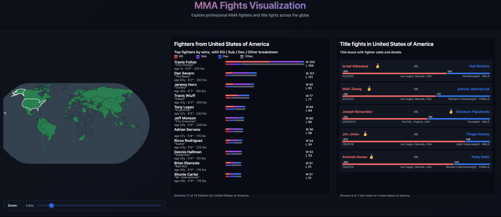

# UFC Fight Data Visualizations

A comprehensive data visualization suite analyzing professional MMA fights, featuring interactive geographic visualizations, betting market analysis, fighter statistics, and career trajectory tracking.

## Overview

This project presents four complementary visualization categories analyzing 5,500+ fights and 5,000+ fighters:

1. **Interactive Globe Visualization** - D3.js-powered web interface displaying fighter distribution and title fights by country
2. **Betting Odds Analysis** - Seven statistical plots evaluating bookmaker prediction accuracy and upset patterns
3. **Fighter Comparison** - Gender-based analysis of physical attributes, correlations, and performance predictors
4. **Temporal Tracking** - Career trajectory visualization for elite fighters over time

## Visualizations

### 1. Interactive Globe (`globe_visualization.html`)



- Hover over countries to explore fighter statistics and title fights
- View win/loss breakdowns by method (KO, Submission, Decision)
- Examine title bout details with odds and outcomes
- Zoom and pan controls for detailed geographic exploration

### 2. Betting Odds Analysis (`odds_visualization.py`)
Seven focused visualizations examining:
- Confidence vs accuracy relationship
- Favorite/underdog win rates by odds margin
- Upset frequency patterns
- Temporal trends in prediction accuracy
- Performance by weight class and gender
- Confusion matrices and distribution comparisons

### 3. Statistical Fighter Comparison (`visualizations.py`)
Gender-based analysis including:
- Physical distributions (height, weight, reach, age)
- Correlation heatmaps
- Random Forest feature importance for predicting wins

### 4. Career Trajectories (`fighters_over_time.py`)
Time-series analysis tracking:
- Wins per year
- Win rate evolution
- Fight activity levels

## Quick Start

### Prerequisites
```bash
pip install -r requirements.txt
```

### Generate Visualizations

```bash
# Statistical fighter comparisons
python visualizations.py

# Betting odds analysis
python odds_visualization.py

# Temporal fighter tracking
python fighters_over_time.py

# Interactive globe (open in browser)
python -m http.server 8000
```

## Project Structure

```
.
├── data/                           # Datasets
│   ├── per_fight_data.csv         # 5,529 fight records
│   ├── fighter_stats_with_gender.csv  # 1,333 fighter profiles
│   ├── pro_mma_fighters.csv       # 5,152 fighters with bio data
│   └── countries.geo.json         # Geographic data
├── plots/                          # Statistical visualization outputs
├── odds_visualizations/            # Betting analysis outputs
├── js/                            # D3.js library and globe script
├── globe_visualization.html       # Interactive web visualization
├── visualizations.py              # Fighter comparison script
├── odds_visualization.py          # Betting analysis script
├── fighters_over_time.py          # Temporal tracking script
└── requirements.txt               # Python dependencies
```

## Datasets

- **per_fight_data.csv**: Fight records with betting odds, outcomes, locations, weight classes
- **fighter_stats_with_gender.csv**: Physical attributes and performance metrics
- **pro_mma_fighters.csv**: Biographical data, country origins, win/loss breakdowns
- **countries.geo.json**: GeoJSON for world map rendering

## Design Highlights

- **Interactive Exploration**: Hover-based interaction model for fluid country exploration
- **Multi-dimensional Analysis**: Four complementary perspectives on MMA data
- **Statistical Rigor**: Machine learning feature importance, correlation analysis
- **Visual Clarity**: Consistent color schemes, appropriate chart types for each analysis
- **Dark Theme**: Modern aesthetic with reduced eye strain for extended exploration

## Technical Stack

- **Frontend**: D3.js v7, HTML5/CSS3, JavaScript ES6
- **Backend**: Python 3.x
- **Libraries**: pandas, matplotlib, seaborn, scikit-learn, numpy

## Key Features

- Gender-specific analysis acknowledging division differences
- Temporal aggregation showing career trajectories
- Betting market accuracy evaluation across multiple dimensions
- Geographic fighter distribution with interactive exploration
- Publication-quality visualizations (300 DPI)

## Author

Victor Micha  
École Polytechnique, Institut Polytechnique de Paris  

## Documentation

For detailed design rationale and technical implementation, see:
- `DataVisualization_UFC_Report.pdf` - Complete project report
- `report.txt` - Detailed technical documentation
- `main.tex` - LaTeX source with comprehensive analysis
